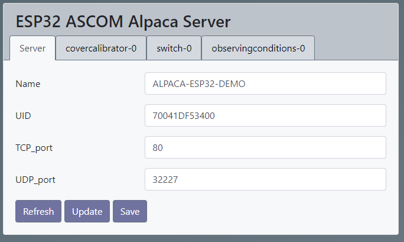

# ASCOM Alpaca Server for ESP32 based devices

This is an ASCOM Alpaca Server implementation for ESP32. 
The following devices are supported:
- Cover Calibrator V1
- Observing Conditions V1
- Switch  V2
- Focuser V3 (in future)

This library is more or less a new implementation. But it's primary based on the great ideas and work of:
- https://github.com/agnunez/AlpacaServerESP32.git 
- https://github.com/elenhinan/ESPAscomAlpacaServer
 
 

## Motivation
My primary motivation was: 
 
- To have a state of the art compact and robust platform for the rework of my ESP32 based devices with propritary network protocols and .NET based ASCOM drivers.
- Learn and understand [ASCOM Alpaca API](https://ascom-standards.org/api/#/)
- Work with embedded systems and web technologies
  

## Features
- Easy to use platform for Alpaca Self Contained Device & Driver
- Templates for CoverCalibrator, Switch and ObservingConditions (Focuser in future)
- Support ASCOM auto discovery
- Optimized for ESP32
- Improved robustness, error handling and debugging
- Device service counter for diagnosis
- Published as library

- Multi ASCOM devices on one ESP32
- Support for several client connections per device 
- Connection watch dog 
    - if no request for a certain time (ALPACA_CLIENT_CONNECTION_TIMEOUT_SEC)
    - impliziet device specific disconnect 
- Pass ASCOM Conform Universal validation with zero errors and issues (ConformU 3.0.0)
- Addapted for ArduinoJason V7 (https://github.com/bblanchon/ArduinoJson.git)

- Test with N.I.N.A 3.1 - with ASCOM Alpaca Discovery (https://nighttime-imaging.eu/)
- Suported ASCOM devices:
    - CoverCalibrator.h, CoverCalibrator.cpp
    - ObservingConditions.h, ObservingConditions.cpp
    - Switch.h, Switch.cpp
    - In future Focuser.h, Focuser.cpp
- Support of ASCOM Methods: action, commandblind, commandbool, commandstring
    - Full implementation for CoverCalibrator
- Configuration via dynamicaly created webpages as developed by (https://github.com/elenhinan/ESPAscomAlpacaServer)

  

## Remarks
- For this project "platformio" (https://platformio.org/) is used as development system
  
- Library dependencies:
    - ESP32AlpacaDevices:
        - "bblanchon/ArduinoJson": "^7.0.2",
        - "me-no-dev/ESP Async WebServer": "^1.2.4",
        - "SLog": "https://github.com/npeter/SLog",
        - "AsyncElegantOTA": "https://github.com/npeter/AsyncElegantOTA"   
        Remark: https://github.com/ayushsharma82/ElegantOTA produces some chrashes inside AsyncTCP (to be investigated)

    - Example: ESP_WifiManager (TODO)
  
- Webpage data has to be stored in the SPIFF-Filesystem of the ESP32
    - platformio/Build Filesystem image
    - platformio/Upload Filesystem Image
  

## Usage
- Let your class inherit the relevant AscomDevice-derived class (e.c. AscomSwitch, AscomCoverCalibrator, AscomObservingConditions)
- Implement all pure virtual functions
- Implement all your device specific functions

ESP32AlpacaDevices class diagram
  

## Useful Links
- [ASCOM Alpaca API](https://ascom-standards.org/api/#/)
- [ASCOM Platform Developer Help](https://ascom-standards.org/Help/Developer/html/7d9253c2-fdfd-4c0d-8225-a96bddb49731.htm)
- [ASCOM Documentation Center](https://ascom-standards.org/Documentation/Index.htm#dev)
- [platformio](https://docs.platformio.org/en/latest/what-is-platformio.html)
- [ArduinoJson](https://arduinojson.org/)
  

## Open Topics
- Concept for AlpacaConfig.h
- Support of ASCOM Methods
    - action
    - commandblind
    - commandbool
    - commandstring
- Test device specific interface with real device implementation

