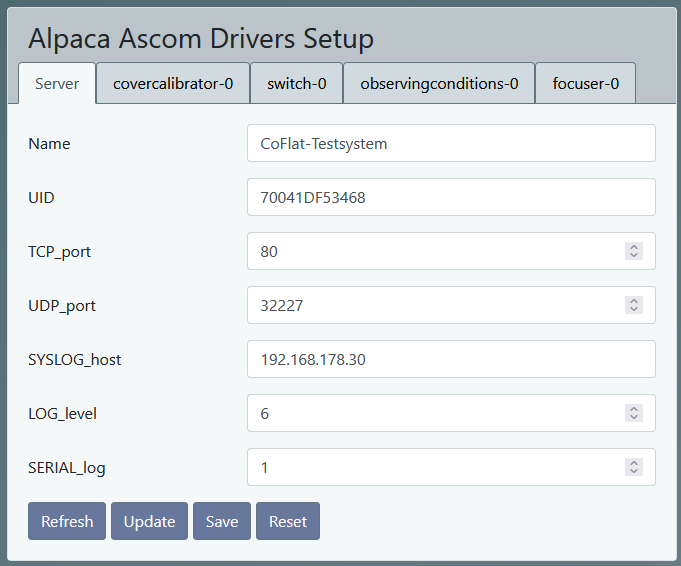
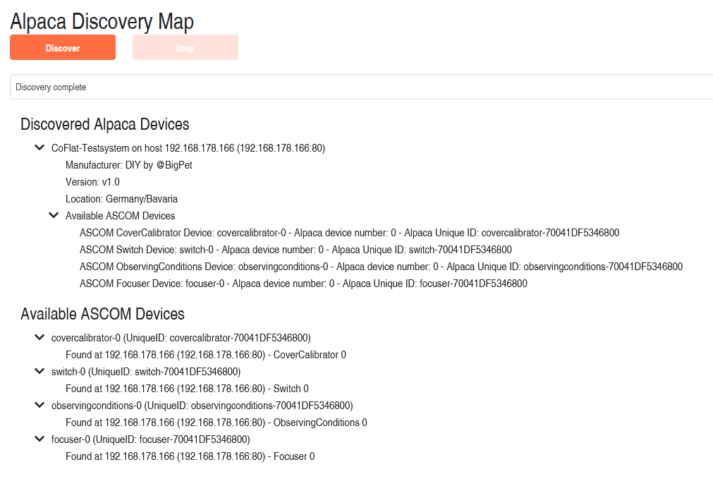

# ASCOM Alpaca Server for ESP32 based devices

This is an ASCOM Alpaca Server implementation for ESP32. 
The following devices are supported:
- Cover Calibrator V1
- Observing Conditions V1
- Switch  V2
- Focuser V3 

This library is more or less a new implementation. But it's primary based on the great ideas and work of:
- https://github.com/agnunez/AlpacaServerESP32.git 
- https://github.com/elenhinan/ESPAscomAlpacaServer
 
 

## Motivation
My primary motivation was: 
 
- To have a state of the art compact and robust platform for the rework of my ESP32 based devices with propritary network protocols and .NET based ASCOM drivers.
- Learn and understand [ASCOM Alpaca API](https://ascom-standards.org/api/#/)
- Work with embedded systems and web technologies
  

## Features
- Easy to use platform for Alpaca Self Contained Device & Driver
- Templates for CoverCalibrator, Switch and ObservingConditions (Focuser in future)
- Support ASCOM auto discovery
- Optimized for ESP32
- Improved robustness, error handling and debugging
- Device service counter for diagnosis
- Published as library

- Multi ASCOM devices on one ESP32
- Support for several client connections per device 
- Connection watch dog 
    - if no request for a certain time (ALPACA_CLIENT_CONNECTION_TIMEOUT_SEC)
    - impliziet device specific disconnect 
- Pass ASCOM Conform Universal validation with zero errors and issues (ConformU 3.0.0)
- Addapted for ArduinoJason V7 (https://github.com/bblanchon/ArduinoJson.git)

- Test with N.I.N.A 3.1 - with ASCOM Alpaca Discovery (https://nighttime-imaging.eu/)
- Suported ASCOM devices:
    - CoverCalibrator.h, CoverCalibrator.cpp
    - ObservingConditions.h, ObservingConditions.cpp
    - Switch.h, Switch.cpp
    - Focuser.h, Focuser.cpp
- Support of ASCOM Methods: action, commandblind, commandbool, commandstring
    - Full implementation for CoverCalibrator
- Logging using SLog: "https://github.com/npeter/SLog"
- Configuration via dynamicaly created webpages as developed by (https://github.com/elenhinan/ESPAscomAlpacaServer)
 
 

  

## Remarks
- For this project "platformio" (https://platformio.org/) is used as development system
  
- Library dependencies: (TODO rework)
    - ESP32AlpacaDevices:
        - "bblanchon/ArduinoJson": "^7.0.2",
        - "me-no-dev/ESP Async WebServer": "^1.2.4",
        - "SLog": "https://github.com/npeter/SLog",
        - "AsyncElegantOTA": "https://github.com/npeter/AsyncElegantOTA"   
        Remark: https://github.com/ayushsharma82/ElegantOTA produces some chrashes inside AsyncTCP (to be investigated)

  
- Webpage data has to be stored in the LittleFS - Filesystem of the ESP32
    - platformio/Build Filesystem image

        **Example:** 
        Building FS image from 'data' directory to .pio\build\wemos_d1_mini32\littlefs.bin
        /www/css/bootstrap.min.css.gz
        /www/css/jquery-ui.min.css.gz
        /www/css/theme.css
        /www/js/bootstrap.min.js.gz
        /www/js/jquery-ui.min.js.gz
        /www/js/jquery.min.js.gz
        /www/js/jsonFormer.jquery.js
        /www/setup.html

    - platformio/Upload Filesystem Image 
        **Example:** 
        Building in release mode 
        Building FS image from 'data' directory to .pio\build\wemos_d1_mini32\littlefs.bin 
        /www/css/bootstrap.min.css.gz        
        /www/css/jquery-ui.min.css.gz 
        /www/css/theme.css 
        /www/js/bootstrap.min.js.gz 
        /www/js/jquery-ui.min.js.gz 
        /www/js/jquery.min.js.gz 
        /www/js/jsonFormer.jquery.js 
        /www/setup.html 
        Looking for upload port... 
        Auto-detected: COM5 
        Uploading .pio\build\wemos_d1_mini32\littlefs.bin 
        esptool.py v4.7.5 
        Serial port COM5 
        Connecting....... 
        Chip is ESP32-D0WDQ6 (revision v1.0) 
        Features: WiFi, BT, Dual Core, 240MHz, VRef calibration in efuse, Coding Scheme None 
        Crystal is 40MHz 
        MAC: c8:c9:a3:cb:7c:d4 
        Uploading stub... 
        Running stub... 
        Stub running... 
        Changing baud rate to 460800 
        Changed. 
        Configuring flash size... 
        Auto-detected Flash size: 4MB 
        Flash will be erased from 0x00290000 to 0x003effff... 
        Compressed 1441792 bytes to 152944... 
        Writing at 0x00290000... (10 %) 
        Writing at 0x002e7915... (20 %) 
        Writing at 0x002ebc14... (30 %) 
        Writing at 0x002f2968... (40 %) 
        Writing at 0x002f6f46... (50 %) 
        Writing at 0x002faf41... (60 %) 
        Writing at 0x002fef3c... (70 %) 
        Writing at 0x00302f37... (80 %) 
        Writing at 0x00307639... (90 %) 
        Writing at 0x0030b5f2... (100 %) 
        Wrote 1441792 bytes (152944 compressed) at 0x00290000 in 9.5 seconds (effective 1214.9 kbit/s)... 
        Hash of data verified. 
        Leaving... 
        Hard resetting via RTS pin... 
 

  

## Usage
- Let your class inherit the relevant AscomDevice-derived class (e.c. AscomSwitch, AscomCoverCalibrator, AscomObservingConditions)
- Implement all pure virtual functions
- Implement all your device specific functions
- See demo application  .\Examples\*

  

ESP32AlpacaDevices class diagram

  

Demo Application: Alpaca Discovery Map generated with **Conform Universal **
  

## Useful Links
- [ASCOM Alpaca API](https://ascom-standards.org/api/#/)
- [ASCOM Platform Developer Help](https://ascom-standards.org/Help/Developer/html/7d9253c2-fdfd-4c0d-8225-a96bddb49731.htm)
- [ASCOM Documentation Center](https://ascom-standards.org/Documentation/Index.htm#dev)
- [platformio](https://docs.platformio.org/en/latest/what-is-platformio.html)
- [ArduinoJson](https://arduinojson.org/)
  

## Open Topics
- Concept for AlpacaConfig.h
- Test device specific interface with real device implementation
    - Already done for 
        - CoverCalibrator [CoFlat](https://github.com/npeter/CoFlat)
        - Focuser MoFo4

    

